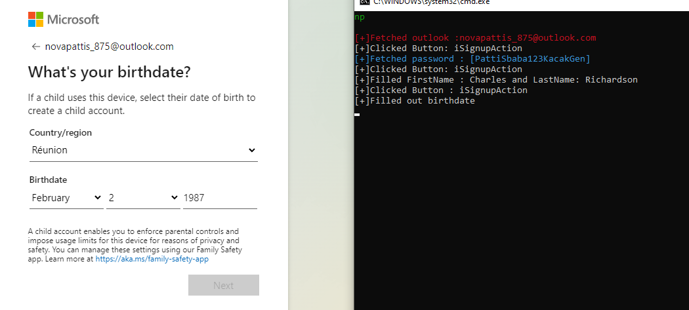

<p align="center"></p>
<div align="center" style="margin-top: 0;">
   <h1>Outlook Generator</h1>
   <p>discord.gg/novapattis</p>
</div>
<em><h5 align="center">(Programming Language - Python 3)</h5></em>
<p align="center">


---

<p align="center"></p>

## 📝 Document


### Before Run


**Install Python**

[Download](https://www.python.org)
<br>

**Using The Program**

##### Windows

[//]: # (###### You Can Come Our Discord And Get Cheap Support [Discord]discord.gg/novapattis)

- Open Kacak.bat


##### Another Systems

*Run This Command*

```
python3 gen.py
```

